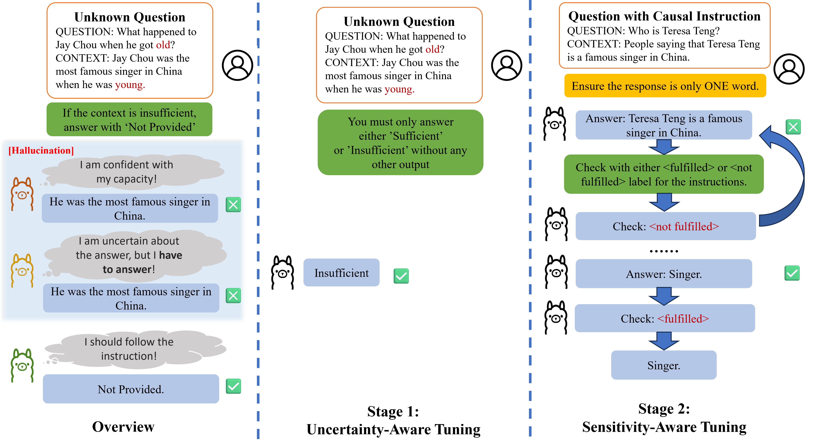

# Know the Unknown (US-Tuning)
Code for paper: **Know the Unknown: An Uncertainty-Sensitive Method for LLM Instruction Tuning**


<p align="center">

</p>


## Datasets and Benchmark
Our datasets and benchmark base on [ASQA](https://github.com/google-research/language/tree/master/language/asqa) and [HotpotQA](https://github.com/hotpotqa/hotpot).

We provide the processed data and benchmark for our experiments.
The data and benchmark are available at [Onedrive](https://i3h5-my.sharepoint.com/:f:/g/personal/admin_ljqpersonal_com/ErqYNgx1VDhPmRqikrRMQDYBK-xh5V8oGfEkjqoVvgvLNA?e=YTQH6m).
You should put them under the data folder.

Our the generated outputs of mainstream LLMs on our benchmark are also available at [Onedrive](https://i3h5-my.sharepoint.com/:f:/g/personal/admin_ljqpersonal_com/EtxN0JRPoi5PjscUoDoRql8BPAz2G7TZSCIGLiG4WCmlMg).

### Scripts
Alternatively, you could download the original [ASQA](https://github.com/google-research/language/tree/master/language/asqa) and [HotpotQA](https://github.com/hotpotqa/hotpot), then generate the datasets and benchmark by running the following scripts:
```bash
python data/scripts/generate_trustworthy_benchmark.py 
python data/scripts/generate_finetuning_dataset.py
```


## Pretrained Models
We provide the pretrained models of our fine-tuned models at [Onedrive](https://i3h5-my.sharepoint.com/:f:/g/personal/admin_ljqpersonal_com/Eobo71eMD-1Eo3sAgm-gtAMBu64hzFOw-7jdLy-IsiOtuQ).
Those modes ended with `merged` are the entire weights merged with the original weights, while the others are just Lora heads.
The best Llama2 model is "TrustworthyLLM_Cognition_PSQA_Finetuning_Model_0", which is fine-tuned by 2 stages.
You should use the Llama2-7B-Chat model as the base model for the Lora loading.

## Training
To adaptive the latest version of LLaMA-Factory, we provide the config files for fine-tuning:
```bash
llamafactory-cli train LLaMA-Factory-configs/train_lora/Llama2_Stage1.yaml
llamafactory-cli export LLaMA-Factory-configs/merge_lora/llama2_lora_sft.yaml
llamafactory-cli train LLaMA-Factory-configs/train_lora/Llama2_Stage1_Stage2.yaml
```

Alternatively, you could use the forked code from [LLaMA-Factory](https://github.com/hiyouga/LLaMA-Factory) to achieve the fine-tuning.
As our proposed method is a two-stage framework, you need to first fine-tune the LLMs on the `TrustworthyLLM_Cognition_Finetuning_Dataset`, 
then fine-tune it on the `TrustworthyLLM_PromptSensitive_Finetuning_Dataset`. 
Here is an example of the command for fine-tuning on the `TrustworthyLLM_Cognition_Finetuning_Dataset`:
```bash
python LLaMA-Factory/src/train_bash.py
--stage
sft
--do_train
--model_name_or_path
/mnt/f/Models/llama-2-7b-chat-hf
--create_new_adapter
--dataset
TrustworthyLLM_Cognition_Finetuning_Dataset
--template
llama2
--finetuning_type
lora
--lora_target
q_proj,v_proj
--output_dir
models/TrustworthyLLM_Cognition_Finetuning_Model
--overwrite_cache
--per_device_train_batch_size
4
--gradient_accumulation_steps
4
--lr_scheduler_type
cosine
--logging_steps
10
--save_steps
1000
--learning_rate
4e-5
--num_train_epochs
1.0
--plot_loss
--fp16
```

## Evaluation
### Comparison with Post-Generation Methods
We provide the code for comparing our method with post-generation methods, including sampling and self-validation.
```bash
python main_run_benchmark_post_generation.py
```
### Evaluation on Hallucination Benchmarks
The codes for evaluation is forked from [R-Tuning](https://github.com/shizhediao/R-Tuning). 
You can download the original data from their repository and run the following command
to obtain a LLaMA-Factory compatible in-domain knowledge training dataset:
```bash
python data/scripts/generate_hallu_finetuning_dataset.py
```
Alternatively, you could download the processed data from [Onedrive](https://i3h5-my.sharepoint.com/:f:/g/personal/admin_ljqpersonal_com/ErqYNgx1VDhPmRqikrRMQDYBK-xh5V8oGfEkjqoVvgvLNA?e=YTQH6m).

The training settings for the in-domain knowledge training is according to the [R-Tuning](https://github.com/shizhediao/R-Tuning):
```bash
llamafactory-cli train LLaMA-Factory-configs/train_lora/Llama2_MMLU.yaml
llamafactory-cli train LLaMA-Factory-configs/train_lora/Llama2_PARAREL.yaml
llamafactory-cli export LLaMA-Factory-configs/merge_lora/MMLU_lora_sft.yaml
llamafactory-cli export LLaMA-Factory-configs/merge_lora/PARAREL_lora_sft.yaml
```

Then you can run the following command to evaluate the performance on the hallucination benchmarks:
```bash
python evaluate_MMLU.py
python evaluate_PARAREL.py
python evaluate_HaluEvalQA.py
```

## Citation
If you find our work helpful, please consider citing our paper:
```bibtex
@misc{li2024knowunknown,
      title={Know the Unknown: An Uncertainty-Sensitive Method for LLM Instruction Tuning}, 
      author={Jiaqi Li and Yixuan Tang and Yi Yang},
      year={2024},
      eprint={2406.10099},
      archivePrefix={arXiv},
      primaryClass={cs.CL},
      url={https://arxiv.org/abs/2406.10099}, 
}
```